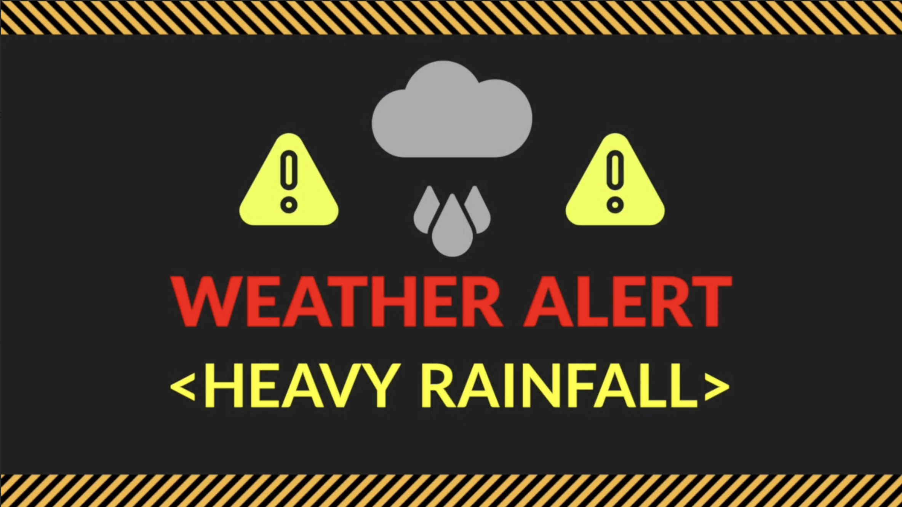
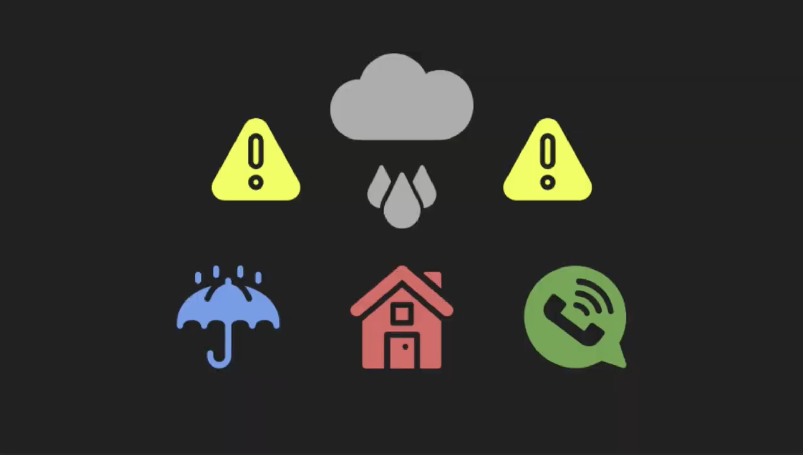

# Project Name: Survival Guide for NYUAD flood 
## by Ian, Jihad, Taskin, Marija ([website](https://theviision.github.io/video_assignment.github.io/))

# Project Description:
## Overall Concept and Theme:
The overarching concept of your project is a practical, yet engaging Survival Guide specifically tailored to handling flooding incidents on a university campus in the UAE. The theme merges humor with gravity, balancing light-hearted elements with essential survival tactics. This dual-tone approach aims to capture the audience’s attention through relatability and entertainment, while also ensuring they retain valuable information on staying safe during floods.
## Experience Created:
By using a combination of real footage from the rain events and staged demonstrations of survival steps, our project strives to create an immersive and memorable viewing experience. The video is structured to first draw in viewers with its serious and scary intro, then pivot to impart survival tips with a funny tone, ensuring the audience is both entertained and educated. The inclusion of authentic clips adds a layer of realism and urgency, reinforcing the relevance and necessity of the advice given.
## Three Key Steps Explored:
1. Wearing Proper Attire: This step emphasizes the importance of being physically prepared for flood conditions, highlighting suitable clothing and gear that can help protect against the elements. Demonstrating this visually can effectively show viewers the practical benefits of being well-equipped.
2. Staying Indoors: Here, the focus is on the safety of remaining inside secure structures during severe flooding, minimizing exposure to hazards. This segment can leverage dramatic footage of outdoor flooding to underscore the risks of venturing outside.
3. Finding the Nearest Authority: The final step guides viewers on how to seek help during emergencies, pointing out the importance of knowing who to contact and where to go when in need. This part can include mock scenarios or reenactments to illustrate how and where students can find help on campus.
The aim of your video is to leave viewers with a clear understanding of how to act during a flood, using a mix of humor and serious messaging to ensure the survival steps are remembered. By the end of the video, viewers should feel more confident about managing similar situations, knowing both the practical steps to take and the resources available to them on campus.

# Process:
## Brainstorming Phase:
During the initial brainstorming phase, our team engaged in ideation sessions aimed at visualizing concepts using storyboards, pictures, and wireframes. We prioritized developing a compelling storyline that resonated with our personal experiences while incorporating elements of humor and impactful storytelling through visual cues. Our team chose to develop a three-step survival guide specifically tailored to navigating floods on the NYU Abu Dhabi campus. 
## Shot Planning:
Following the conceptualization stage, we dissected our story to identify the specific shots required to effectively convey each frame. This involved determining the visual narrative that best aligned with our storyline and listing down the necessary shots in sequential order. As we progressed, we iterated on our shots to ensure coherence with the overall narrative and synchronization with audio elements. We took the shots from different angles and worked to fix the lighting of our shots. Some shots were taken during the flood and those are original videos of rain, and we decided to keep them in the same way to create a realistic vibe. We contacted people whom we needed to act for our video project, and as acknowledgment, our C2 security personnel acted in our video. 
From sweeping panoramas to intimate close-ups, we leveraged the full spectrum of perspectives to immerse our audience in the narrative. Moreover, we dedicated significant effort to perfecting the lighting of our shots, sculpting the mood and ambiance with precision.
## Authenticity in Action:
For scenes depicting the flood, we opted for an authentic approach, capturing original footage of rainfall to imbue our project with a sense of realism. These shots, captured amidst the deluge, lent an air of authenticity to our narrative, transporting viewers into the vibe of the storm. By seamlessly blending these original recordings with our footage, we achieved a heightened sense of immersion and believability. 
## Script Development and Audio Recording:
The dialogue scripting process entailed crafting dialogues tailored to complement the selected shots and advance the narrative. Our dialogues were strategically designed to provide guidance on three crucial steps for surviving the flood scenario depicted in the video. Audio Clips were recorded separately and edited to match the shots. 
Video Editing: 
Video editing is one of the crucial parts of our project. We compiled the shots and edited them using software, along with editing some shots separately and adjusting them. Additionally, we seamlessly merged audio elements with the footage to enhance the overall quality. 
## Web Development: 
Web development for this project was smoother than before, thanks to our clear vision from the start. Our team chose a distinctive design blending the urgency of Amber alerts with the clear visibility of wet floor signs. This approach led to the implementation of an eye-catching warning popup that engages users immediately upon their arrival at the site. After closing the popup, users find a coherent color scheme that enhances the website's aesthetic and aligns with the video's storyline. This integration of visual elements not only creates a seamless user experience but also deepens audience engagement by drawing them into the narrative from the first interaction.
## Casting and Collaboration:
No cinematic endeavor is complete without a talented cast to bring the story to life. Leveraging our network of contacts, we enlisted individuals whose performances would elevate our project to new heights. Notably, we extend our heartfelt appreciation to the C2 security personnel, whose participation added a layer of authenticity to our narrative. Through their collaboration, we were able to capture moments of tension and drama that resonate with viewers on a visceral level.
## Software and Instruments: 
1. iPhone
2. iMovie
3. Adobe Premier Pro
4. Dynamic Microphone

# Reflection/Evaluation:
Our goal was to craft an engaging and informative guide that would resonate deeply with the NYU Abu Dhabi community, particularly in light of recent flooding events. Through a blend of humor and essential survival tips, we aimed to leave our audience both informed and prepared.

In terms of the technical aspects, our shot planning and video editing processes were pivotal in achieving a high-quality final product. The use of authentic flood footage added a layer of realism that we were aiming for. 

An essential component of our process in the project was the effective coordination through a well-structured script. Early on, we recognized the importance of a meticulously crafted script to guide the entire production process. This script not only outlined the dialogue and actions but also detailed the sequence and timing of each scene. This precise planning was instrumental in achieving our target video length and ensuring that every segment conveyed its intended message without redundancy or omission.

However, there were challenges along the way. Coordinating shoots and managing the logistics of filming tested our adaptability and resourcefulness. Despite these hurdles, the team's ability to pivot and find creative solutions was a learning experience in itself and something we consider a success.

Overall, the project not only achieved its intended goal of educating and preparing students for flood scenarios but also served as a profound learning experience for everyone involved. It fostered a sense of community and collaboration that we will carry forward into future projects.

